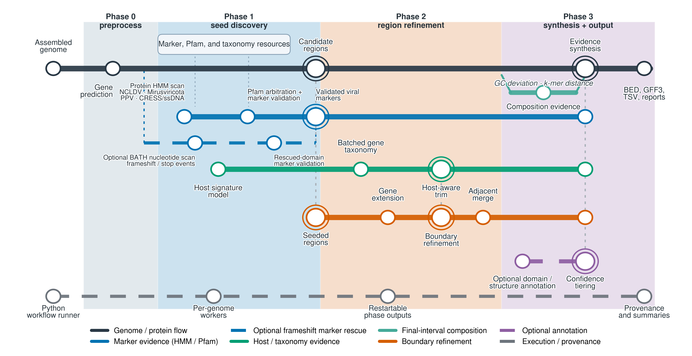

# ViroSync


[](LICENSE)

ViroSync identifies candidate endogenous viral elements (EVEs) in assembled
eukaryotic genomes. It searches for viral markers, refines candidate boundaries
with gene taxonomy and host-like sequence signals, and scores the resulting
regions.

## Workflow



ViroSync processes each genome in four phases:

1. Predict proteins after optional repeat masking.
2. Find and validate viral markers, then assemble seed regions.
3. Refine region boundaries with gene taxonomy and host-like sequence signals.
4. Score each candidate and write the accepted EVE set and reports.

## Install ViroSync

ViroSync supports Linux x86-64 and uses [Pixi](https://pixi.sh/) for its pinned
environment.

```bash
git clone https://github.com/NeLLi-team/virosync.git
cd virosync
pixi install --locked
pixi run setup-virosync-resources
```

Resource setup downloads and verifies `resources_v1_0_7_runtime.tar.gz`. See
[Get started](docs/getting-started.md) for the installation checks.

## Quick start

Run the shipped example:

```bash
pixi run example
```

The task writes to `results/example/`. Check the batch summary:

```bash
cat results/example/batch_summary.tsv
```

The `test-1` row must have `status=success`, `predictions=6`, and `accepted=1`.
The resource tree records the database version separately:

```bash
cat resources/virosync/DB_VERSION
```

It must print `v1.0.7`.

## Run your own genomes

Give `-i` a single FASTA file:

```bash
pixi run virosync \
  -i genome.fna \
  -o results/my_genome \
  --config config/orchestration.yaml \
  -w 1 \
  --threads-per-worker 16
```

Or a directory of FASTA files:

```bash
pixi run virosync \
  -i genomes/ \
  -o results/my_genomes \
  --config config/orchestration.yaml \
  -w 4 \
  --threads-per-worker 16
```

ViroSync reads `.fna`, `.fasta`, and `.fa` files. It does not search
subdirectories. `-i` also accepts a text file with one FASTA path per line.
`-w` sets how many genomes run at the same time. `--threads-per-worker` sets
the threads for each of those genomes.

The [documentation](https://nelli-team.github.io/virosync/) covers input modes,
command-line options, outputs, performance tests, and optional analyses.

ViroSync is available for non-commercial use under the terms in [LICENSE](LICENSE).
