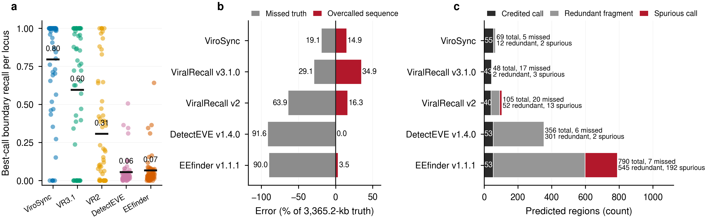
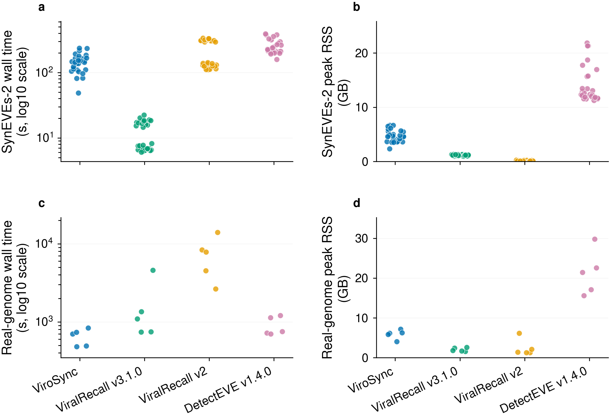
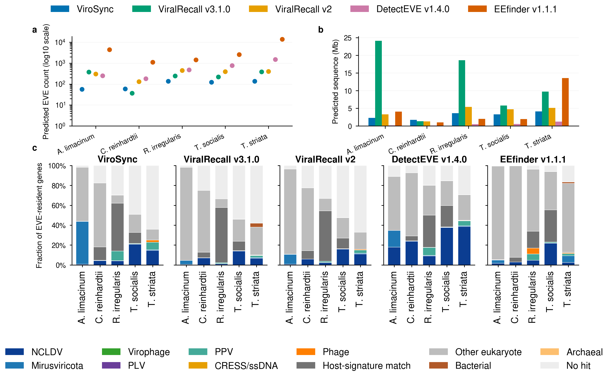

# Performance

Benchmark runs used ViroSync commit `a43a34f`, the v1.0.7 core resources, one
worker, and 16 threads. The benchmark disabled frameshift screening, TMVec2,
InterProScan, and the optional structure steps. The figures come from benchmark
commit `094b76e`.

Select a figure to open the full-size image.

## Synthetic boundary recovery

The synthetic set contains 60 loci and 3,365.2 kb of inserted sequence. Mean
best-call boundary recall was 0.796 for ViroSync, 0.596 for ViralRecall v3.1.0,
0.307 for ViralRecall v2, 0.056 for DetectEVE v1.4.0, and 0.066 for EEfinder
v1.1.1.

*Boundary recovery and call burden across 60 synthetic loci. Panel a credits
the call with the highest Jaccard index at each locus. Panel b compares missed
and outside-truth sequence. Panel c partitions calls at a 500 bp one-to-one
threshold. The test excludes 30 survey-derived loci whose source elements
ViroSync found before this comparison. Region detection has no true negative,
so the plot does not report specificity or accuracy.*

## Runtime and peak memory

Mean wall time across 30 SynEVEs-2 inputs was 143.7 seconds for ViroSync and
12.3 seconds for ViralRecall v3.1.0. Across five real-genome inputs, the means
were 649.0 and 1,705.5 seconds. Campaign concurrency differed, so these values
do not give a general speed ranking.

*Per-input wall time and peak resident memory for 30 SynEVEs-2 inputs and five
real-genome inputs. All tools used 16 threads or cores on the same 64-core
host, but campaign concurrency differed. Wall time includes contention and
database caching. Peak RSS is the largest single process, not the total for
the process tree. EEfinder is absent because its campaign used a different
load and concurrency.*

## Real-genome output

The five real genomes have no complete region-level truth set. The figure
describes output burden and gene content, not detection accuracy.

*Candidate count, called sequence, and gene composition across five real
genomes. DetectEVE and EEfinder emit short homology hits. Their counts measure
output granularity and are not direct locus-count comparisons.*

See [Methods](METHODS.md) for the ViroSync workflow and output rules.
