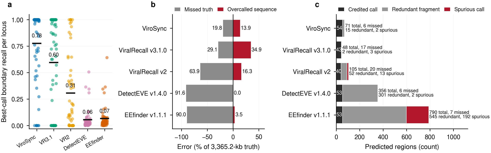
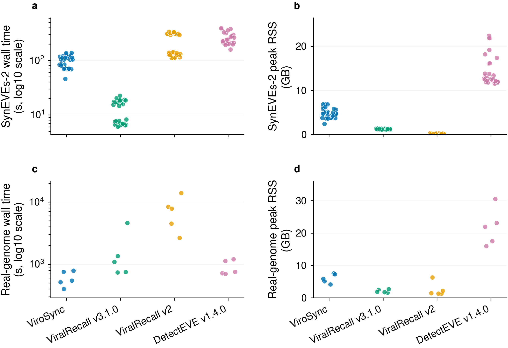
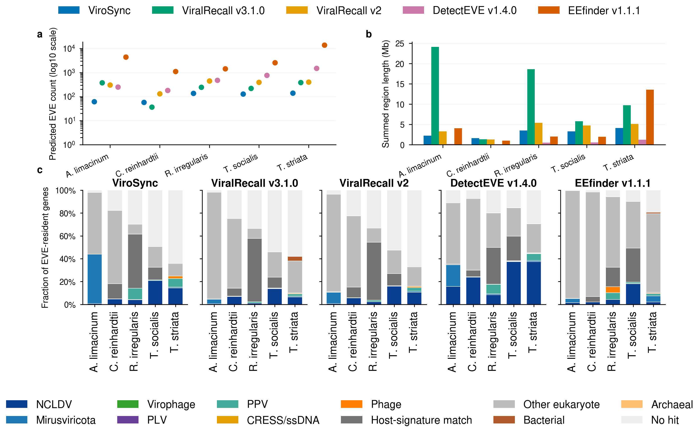

# Performance

The September 19 benchmark used ViroSync 1.0.1 with GenomeTools seed indexing,
shared repeat comparisons and development resources v1.1.0. Its source SHA-256 was
`a19fe5516183507df1c5d16cf794670baef0dfa769fd78bf7f135ee53a2ec3e3`.
Resource bundle v1.1.0 is an unreleased development bundle; the public default
and the shipped examples use resource bundle v1.0.7.
That campaign ran with one worker and 16 threads per input, at most two inputs
at once, and no optional analyses. All figures below describe that campaign;
the [paired repeat-annotation regression](#paired-repeat-annotation-regression)
is reported separately. Select a figure to open the full-size image.

## Synthetic boundary recovery

The synthetic set contains 60 loci and 3,365.2 kb of inserted sequence. Mean
best-call boundary recall was 0.777 for ViroSync, 0.596 for ViralRecall v3.1.0,
0.307 for ViralRecall v2, 0.056 for DetectEVE v1.4.0, and 0.066 for EEfinder
v1.1.1.

*Boundary recovery and call burden across 60 synthetic loci. Panel a credits
the call with the highest Jaccard index at each locus. Panel b compares missed
and outside-truth sequence. Panel c partitions calls at a 500 bp one-to-one
threshold. Missed-locus labels use recovery after the union of call fragments,
which can recover a locus without a credited one-to-one call. The test excludes
30 prior-discovery loci whose source elements ViroSync found before this
comparison. Region detection has no true negative,
so the plot does not report specificity or accuracy.*

## Runtime and peak memory

Mean wall time across 30 SynEVEs-2 inputs was 100.5 seconds for ViroSync and
12.3 seconds for ViralRecall v3.1.0. Across five real-genome inputs, the means
were 600.0 and 1,705.5 seconds. Campaign concurrency differed, so these values
do not give a general speed ranking.

*Per-input wall time and peak resident memory for 30 SynEVEs-2 inputs and five
real-genome inputs. All tools used 16 threads or cores on the same 64-core
host, but campaign concurrency differed. All ViroSync timings come from the
September 19 campaign. Wall time includes contention and database caching.
Peak RSS is shown in decimal GB for the largest single
process, not the process tree. EEfinder is absent because its campaign used
different load and concurrency.*

## Real-genome output

ViroSync accepted 524 regions across the five real genomes. These inputs have
no complete region-level truth set. The figure describes output burden and
gene content, not detection accuracy.

*Candidate count, summed region length, and gene composition across five real
genomes. DetectEVE and EEfinder emit short homology hits. Their counts measure
output granularity and are not direct locus-count comparisons.*

See [Outputs](METHODS.md) for the result files and their interpretation.

## Paired repeat-annotation regression: October 5–6, 2026 {#paired-repeat-annotation-regression}

The paired run compared baseline commit `1ceea9d` with repeat-evidence commit
`8a64514` on 155 frozen inputs. Both source snapshots reported ViroSync 1.0.1 at
the time of testing. Each variant used the same input bytes, runtime,
configuration and development resource bundle v1.1.0. This bundle is distinct
from the public default, v1.0.7. The source content SHA-256 values were:

- Baseline: `35f948433846ade725845b4b4f332b18aa3229186292df852d222c154ac93966`.
- Repeat evidence: `2df54f21cd8fedb68895a46b54407e1f4adbc96e6e3b570ebf120366d3b2f893`.

The resource manifest SHA-256 was
`f9fe4d4202e14dd8fe099b2bf06354c7110dd2b43075e1004d2f550303688eb9`.
Each run used one worker and 16 threads per input, with two inputs running at
once. Frameshift screening, TMVec2 and InterProScan were disabled. Both variants
started fresh, and source-specific validators checked all 310 completed runs.

All 155 pairs preserved the legacy prediction values, EVE identifiers,
endpoints, confidence tiers and sequence exports. The comparison excluded the
added repeat-evidence columns and the output/coordinate schema-version fields;
7,493 interval, sequence and gene-taxonomy export files were byte-identical.
Both variants accepted 654 EVE rows across the full panel.

| Panel | Inputs | Baseline and repeat-evidence result |
| --- | ---: | --- |
| Reported synthetic pool, ds01–30 and ds61–90 | 60 | 54 loci detected at the 500 bp one-to-one overlap threshold; mean best-call recall 0.7767 and Jaccard 0.6261. |
| Prior-discovery panel, ds31–60 | 30 | 30 loci detected; mean best-call recall 0.9142 and Jaccard 0.6809. |
| Survey catalog, ds91–108 | 18 | 22 accepted EVE rows; burden only, excluded from accuracy claims. |
| Selected repeat controls | 42 | Zero accepted calls in two original windows and 40 spiked variants. |
| Real genomes | 5 | 531 accepted EVE rows; burden only, without complete locus truth. |

The reported synthetic pool is separate from the prior-discovery panel. It is
semi-synthetic, and its tethysvirus source overlaps references in bundle v1.1.0.
The selected repeat controls do not establish genome-wide specificity.

The repeat-evidence variant recorded 1,978 same-orientation pair annotations
across 242 detailed candidates, including accepted and rejected candidates.
The endpoint statuses preserve incomplete and unassessed searches. These counts
describe annotations, not confirmed viral termini or insertion junctions. The
panel lacks independent repeat-boundary truth, so it does not measure
repeat-boundary sensitivity.

### Paired runtime and memory

The sum of per-input wall times was 19,452.28 seconds for the baseline and
19,803.93 seconds with repeat evidence, an increase of 1.8%. These sums are not
campaign elapsed times because inputs ran concurrently. Across the 155 pairs,
the median modified/baseline wall-time ratio was 0.9994 and the median peak-RSS
ratio was 1.0001. For the five real genomes, summed wall time increased from
3,101.33 to 3,486.82 seconds, or 12.4%. Individual real-genome increases ranged
from 3.1% to 23.8%, with a median ratio of 1.1064.

Baseline ran first, so the second variant could benefit from warmer input and
database caches. Wall time includes Pixi startup. These are single paired
observations, not randomized or replicated timing estimates. GNU time peak RSS
describes the largest single process, not the concurrent process-tree total.
